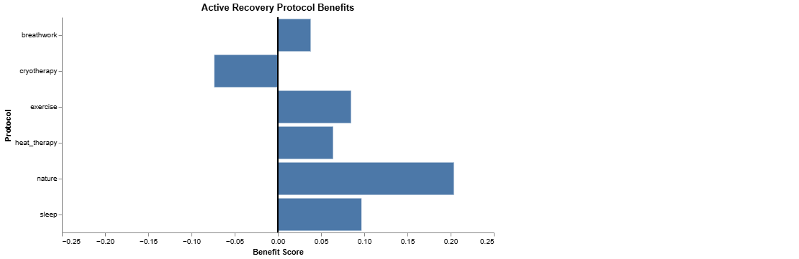
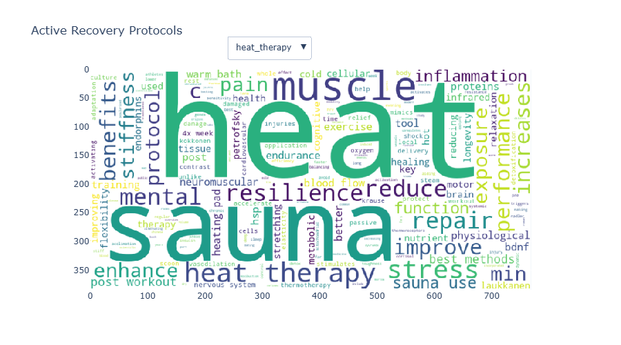

# Visualizations of LLM Output - Active Recovery Protocols

*Jonathan Chia - Data Visualizations Class @ Johns Hopkins - 7/19/2025*

## Introduction

As a workaholic, I have burned out multiple times in my life. My worst burnout lasted for an entire summer. I had absolutely no energy or motivation, so I lounged around a whole summer playing videogames and eating food. 

One day, while scrolling through Youtube, I came across a video titled [Clearing Your Allostatic Load Make Laziness Impossible](https://www.youtube.com/watch?v=QNKhJtQpboU&t=492s) by Rian Doris, a cofounder of the Flow Research Collective. The video talked about using active recovery to never burnout again. 

Applying the active recovery protocols changed my life. I started doing cold plunges, sauna, sleeping better, exercising more, and since then, I haven't burned out and my output has increased. 

This project aims to visualize some of the text outputs from DeepSeek about the 6 main active recovery protocols:

* Breathwork
* Cryotherapy
* Exercise
* Heat Therapy
* Nature Immersion
* Sleeping

## Analysis

### Questions

1. According to DeepSeek, how related are these active recovery protocols? 
2. What are the main benefits, and how do these benefits overlap?  
3. How can I summarize all of this text data using visualizations? 

### Initial Exploration

First, I asked DeepSeek some general questions about active recovery, and then I placed the answers into the [active_recovery](active_recovery.txt) file. 

From there, I started playing around with the data in my [draft](draft.ipynb) notebook. I realized I could do much better text analysis if I had some better separation of my text. 

Thus, I went back to the drawing board and split my text data into three parts for each of the protocols:

1. Overview
2. Execution
3. Benefits

This would allow me to much easier get answers and visualizations for questions 1 and 2. 

### Question 1: How Related Are these Active Recovery Protocols? 

The best way to visualize this would be through a correlation heatmap. To get these correlations, I decided to turn these protocols into document embeddings, and then calculate the cosine similarity. Like TF-IDF or bag of words, embeddings is just a more advanced way to represent text as numbers. For an overview of embeddings, see this [embeddings](https://developers.google.com/machine-learning/crash-course/embeddings) crash course from Google.

```
embeddings = model.encode(documents, convert_to_tensor=True) # each document is the text for each active recovery protocol
```

I don't need a particularly fancy model, so I decided to use the pre-trained all-miniLM-L6-v2 model from the sentence_transformers package to generate the embeddings. With these embeddings, I now have a numeric representation of each of the active recovery protocols. 

Next, I calculate the cosine similarity between the embeddings (could use another metric like euclidean distance if you want), and then place those into a similarity matrix. Now, I can see how related these active recovery protocols are.

```
Similarity Matrix:
[[1.0000002  0.35337472 0.55132973 0.5183076  0.53135264 0.5063235 ]
 [0.35337472 1.0000004  0.6192724  0.50839937 0.37734425 0.3363817 ]
 [0.55132973 0.6192724  1.         0.5834539  0.59140074 0.5238651 ]
 [0.5183076  0.50839937 0.5834539  0.99999994 0.6421325  0.63790226]
 [0.53135264 0.37734425 0.59140074 0.6421325  1.0000002  0.60041714]
 [0.5063235  0.3363817  0.5238651  0.63790226 0.60041714 0.9999996 ]]
```

This is not very easy to read, so I built a heat map. See [similarity matrix](#similarity-matrix) section for the visualization.

I also built a [chord chart](#chord-chart) to see if it is easier to visualize the similarity using widths instead of plain numbers. 

### Question 2: What are the Benefits Associated with These Active Recovery Protocols, and How do They Compare? 

The main benefits of active recovery can be broadly summarized into 5 categories:

1. Physiological Repair
2. Nervous system balancing
3. Neuromuscular function
4. Cognitive and emotional resilience
5. Long term metabolic and cellular resistance

I essentially want a final table that looks like this:


| Active Recovery Protocol | Physiological Repair | Nervous System Balancing | Neuromuscular Function | Cognitive and Emotional Resilience | Long-Term Metabolic and Cellular Resistance |
|-------------------------|----------------------|--------------------------|-------------------------|------------------------------------|--------------------------------------------|
| Breathwork              | 1                    | 2                        | 1                       | 2                                  | 1                                          |
| Cryotherapy             | 4                    | 1                        | 3                       | 1                                  | 5                                          |
| Exercise                   | 3                    | 5                        | 4                       | 5                                  | 2                                          |
| Heat Therapy                   | 5                    | 3                        | 2                       | 3                                  | 4                                          |
| Nature                 | 2                    | 4                        | 5                       | 4                                  | 3                                          |
| Sleep           | 5                    | 5                        | 5                       | 5                                  | 5                                          |

I expect sleep to have the highest scores, and I expect breathwork to have the weakest scores. 

I expect nature and exercise to be pretty similar, but exercise will be higher overall.

**Now, how do I turn the text data into a table like above?**

I need some way to transform the intensity of the words to a score. For example, 'sleep strongly improves muscle repair' would have a higher score than 'breathwork mildly increases muscle repair.' 

There's a few different ways to approach this (such as creating a dictionary of words and assigning them a score), but I realized that someone probably already built a pre-trained model that can help measure this. Something like a sentiment analysis scoring model. 

After more research, I found the [VADER](https://ojs.aaai.org/index.php/ICWSM/article/view/14550) (Valence Aware Dictionary and sEntiment Reasoner) model. What the researchers did was get a ton of human raters to build a curated sentiment intensity dictionary. For example, love is +3 and hate is -3. Additionally, they added some features to account for adjectives such as 'kind of' or 'extremely'. Lastly, they add additional rules to handle punctuation, captilization, and degree modifiers. If a word is in all caps, it has a stronger sentiment. From there, it's just a matter of adding up scores!

Using the VADER model, I examined each sentence from the benefit text files. 

```
score = analyzer.polarity_scores(sentence)
```

From there I got the mean score for each benefit for each active recovery protocol, and put it into a table:

| active_recovery_protocol   |   physiological_repair |   nervous_system_balancing |   neuromuscular_function |   cognitive_and_emotional_resilience |   long_term_metabolic_and_cellular_resistance |
|:---------------------------|-----------------------:|---------------------------:|-------------------------:|-------------------------------------:|----------------------------------------------:|
| breathwork                 |                   0.07 |                       0.17 |                     0.12 |                                 0.04 |                                          0.05 |
| cryotherapy                |                   0.01 |                       0.02 |                     0.11 |                                -0.07 |                                          0.14 |
| exercise                   |                   0.03 |                       0.12 |                     0.06 |                                 0.08 |                                          0.05 |
| heat_therapy               |                   0.02 |                      -0.02 |                     0.13 |                                 0.06 |                                          0.15 |
| nature                     |                   0.05 |                       0.10 |                     0.10 |                                 0.20 |                                          0.14 |
| sleep                      |                   0.01 |                      -0.02 |                     0.05 |                                 0.10 |                                         -0.07 |

Again, this is a bit painful to read through as a table, so I built a [sentiment bar chart](#sentiment-bar-chart) visualization.

#### What about just the intensity of the emotion? 

Since we know all these benefits are positive, how about we just grab the intensity of emotion? 

VADER provides positive, negative, and neutral proportions for each sentence. With this, I can sum the negative and positive values to get emotional intensity:

```
score = analyzer.polarity_scores(sentence)
intensity_score = score['neg'] + score['pos']
```

Now, I can create a new table:

| active_recovery_protocol   |   physiological_repair |   nervous_system_balancing |   neuromuscular_function |   cognitive_and_emotional_resilience |   long_term_metabolic_and_cellular_resistance |
|:---------------------------|-----------------------:|---------------------------:|-------------------------:|-------------------------------------:|----------------------------------------------:|
| breathwork                 |                   0.12 |                       0.19 |                     0.12 |                                 0.17 |                                          0.16 |
| cryotherapy                |                   0.11 |                       0.23 |                     0.12 |                                 0.18 |                                          0.17 |
| exercise                   |                   0.08 |                       0.13 |                     0.09 |                                 0.09 |                                          0.14 |
| heat_therapy               |                   0.13 |                       0.24 |                     0.16 |                                 0.20 |                                          0.12 |
| nature                     |                   0.08 |                       0.20 |                     0.14 |                                 0.23 |                                          0.18 |
| sleep                      |                   0.10 |                       0.17 |                     0.13 |                                 0.13 |                                          0.13 |

This is also a pain to look at, so I created a [radar chart](#radar-chart) visualization.

### Question 3: How can I summarize all of this text data using visualizations? 

I would like to add key visualizations to my README in this repository. This will help users to quickly understand the topic at hand. 

In terms of analysis, I need to aggregate the most important words together while removing stop words or ones not related to active recovery.

I used the wordcloud package to generate some static word cloud images. The wordcloud package already comes with stop words, so I used that and added my own. 

See the [word cloud](#word-cloud) visualization section!

---

## Visualization of Text Analysis

### Question 1: How Related Are these Active Recovery Protocols? 
#### Similarity Matrix


This visualization helps users quickly answer the question - how related are these active recovery protocols? 

Based on these results, we can immediately see that cryotherapy is the most unique from the rest.

We can also see that exercise is very similar to nature-based recovery and sleeping.

What is fascinating is that cryotherapy and heat therapy are the most similar with each other compared to the other protocols.

Here are the most related pairings:

* cryotherapy <-> heat therapy
* exercise <-> sleep 
* nature <-> exercise

Breakthwork is the loser, not having any strongest similarity with any other protocol:

* breathwork -> heat therapy

The main interaction feature for this chart is the tooltip. This makes it easier on the user to quickly explore the chart.

This is still a bit painful because you have to read numbers. Thus, I decided to try chord chart!

#### Chord Chart


Because all of these are relatively closely related, at first, this chart seems a bit useless.

Where it shines is through the interactivity. On selecting an active recovery protocol, it's very easy to quickly see which are most related.

For example, in the below chart, I can quickly see that sleep is least related to cryotherapy:


I might prefer this chart over the similarity heat map, because the user doesn't have to read numbers. 

### Question 2: What are the Benefits Associated with These Active Recovery Protocols, and How do They Compare? 

#### Sentiment Bar Chart



This visualization allows the user to filter through different key benefits, and see DeepSeek's sentiment towards these benefits. 

We can see some negative sentiment for emotional resilience for cryotherapy. Why?

```
text = 'Used in protocols for **depression & anxiety** (e.g., Wim Hof Method).'
analyzer.polarity_scores(text)
```

```
{'neg': 0.375, 'neu': 0.625, 'pos': 0.0, 'compound': -0.6597}
```

Depression and anxiety are very negative words. We would need a more advanced NLP model to understand that *cold therapy helps treat depression and anxiety*. 

We can also use the filter to see sentiment toward all benefits:


Looks like nature has the highest positive sentiment. 

#### Radar Chart


This visualization allows the user to see DeepSeek's intensity of emotion toward every active protocol. 

You can quickly see that the emotion is relatively the same across each protocol. This would make sense because DeepSeek provided me informative and rather scientific explanations about the benefits of these active recovery protocols. 

Users can hide or display active recovery protocols by clicking on the legend:


Here, DeepSeek is displaying more emotional intensity towards nervous system balancing and emotional resilience for heat therapy. This might suggest that heat therapy has stronger impact on nervous system balancing and emotional resilience compared to the other benefits. 

### Question 3: How can I summarize all of this text data using visualizations? 

#### Word Cloud



This word cloud chart gives an overview of each active protocol. The user can select the active protocol in the selection button.

This is a super convenient way to get an idea of each active recovery protocol.

## Conclusion

In conclusion, I learned a few different text analytics techniques for this project including embeddings, VADER sentiment analysis, bigrams, and stopwords. I also learned a few different visualization techniques leveraging Altair, plotly, wordcloud, hv, and bokeh. 

My biggest learning is that sentiment analysis is very difficult. The entire cryotherapy section focused on reducing stress, anxiety, and depression, but my sentiment analysis marked these as negative statements. I can see why leveraging advanced NLP deep learning networks would be best compared to leveraging rule-based systems like VADER. I also recognize that VADER was made specifically for analyzing social media sentiment, so it doesn't apply best here in a more scientific context. 

Another huge takeaway is that chord charts can be better than heatmaps! It's easier to visualize width than read a number. 

## References

* Hutto, C. J., & Gilbert, E. (2014). VADER: A Parsimonious Rule-based Model for Sentiment Analysis of Social Media Text. Proceedings of the International AAAI Conference on Web and Social Media, 8(1), 216–225. https://ojs.aaai.org/index.php/ICWSM/article/view/14550
* Google. (n.d.). Embeddings: Translating to a vector space. Google Machine Learning Crash Course. https://developers.google.com/machine-learning/crash-course/embeddings
* HoloViews Developers. (n.d.). Chord. HoloViews Documentation. https://holoviews.org/reference/elements/bokeh/Chord.html
* StatQuest with Josh Starmer. (2022, March 15). StatQuest: Embeddings [Video]. YouTube. https://www.youtube.com/watch?v=vRbSnlRyJNQ
* Doris, R. [Flow Research Collective]. (2023, Month Day). Clearing Your Allostatic Load Make Laziness Impossible [Video]. YouTube. https://www.youtube.com/watch?v=QNKhJtQpboU&t=492s